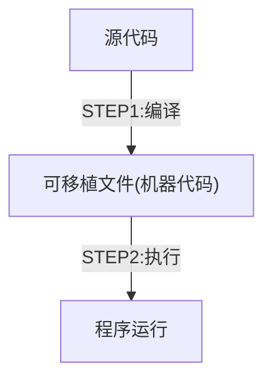
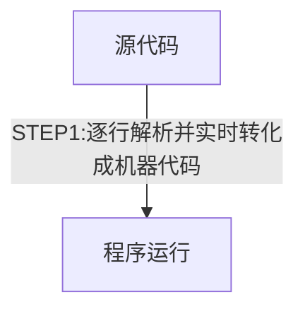
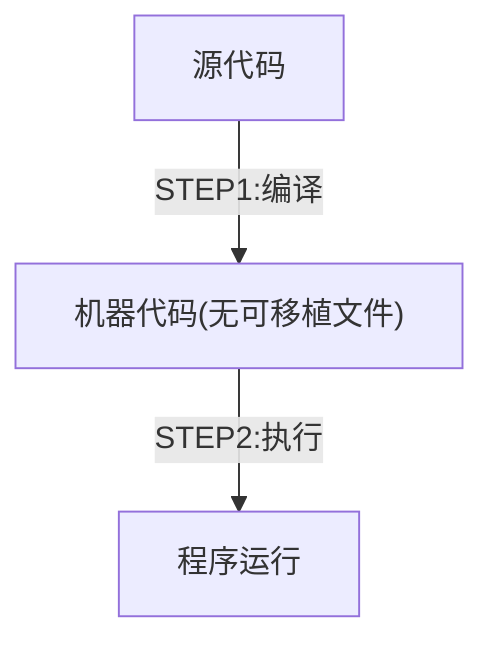
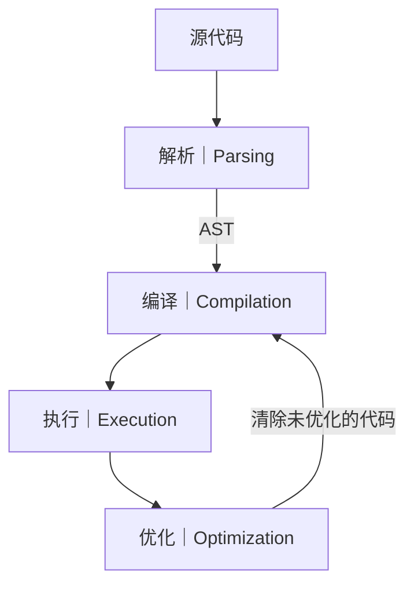

# JavaScript 运行原理

**JavaScript 是一种高级的、面向对象的、多范式的编程语言。**

## JavaScript 的特性

### 1. 高级语言|High-level

在计算机科学中，高级语言是指那些具有更高抽象度和更简洁语法的语言。它们通常比低级语言（如汇编语言）更易读和使用。
比如 C ，它们需要手动管理内存（例如 malloc() 和 free() 释放内存），否则会导致内存泄漏。而像 JavaScript 这样的高级语言则不需要这些繁琐的步骤，因为它会自动处理内存管理。但带来缺点是它们的运行速度不能像 C 一样快。

### 2. 垃圾回收|Garbage Collection

在 JavaScript 这样的 高级语言（High-level languages） 中，资源管理是自动的，例如：

-   垃圾回收（Garbage Collection）：JavaScript 由引擎（如 V8）自动管理内存，开发者不需要手动分配或释放内存。
-   自动内存管理：当变量不再被引用时，JavaScript 的垃圾回收机制会自动释放它们的内存。

### 3. 解释执行或及时编译|Interpreted or just-in-time compiled

-   解释型语言（Interpreted Language）指的是代码不需要预先编译，而是由解释器逐行执行。例如，Python 和 JavaScript 是解释型语言。
-   JavaScript 引擎（如 Chrome 的 V8）采用了一种 JIT（Just-In-Time）编译技术，它会在代码运行时将部分 JavaScript 代码编译成机器代码，提高执行速度。

### 4. 多范式语言|Multi-paradigm

JavaScript 是一种多范式语言，Multi-paradigm（多范式） 指的是一种编程语言支持多种编程范式（Paradigm），开发者可以根据需求选择不同的编程风格来编写代码。

-   过程式（Procedural Programming）：通过函数和过程来组织代码。
-   面向对象（Object-Oriented Programming）：通过类和对象来组织代码。
-   函数式（Functional Programming）：通过函数来组织代码。

一些编程语言只能支持以上其中一种范式，而 JavaScript 支持以上所有范式。

### 5. 基于原型链的面向对象编程|Prototype-based object-oriented

在 Javascript 中，除了基本数据类型（如数字、字符串、布尔值等），几乎所有的东西都能被当为对象。并且 JavaScript 的对象是基于原型链（Prototype Chain）实现的。原型其实可以理解为一个模版，当创建一个新的对象时，这个新对象会继承这个模版
例如数组，在 JavaScript 中，数组是一个对象，而数组的原型上包含了 `.push` `.pop`等方法。所以我们才可以通过数组来调用这些方法。

### 6. 函数作为第一类公民|First-class functions

在 JavaScript 中，函数是一等公民，这意味着函数可以被当做变量来使用。我们可以将函数传递给其他函数，也可以从函数中返回另一个函数。例如：

```js
//将一个函数作为参数传递给另一个函数
const closeModel = () => {
    modal.classList.toggle("hidden");
};
overlay.addEventListener("click", closeModel);
```

### 7. 动态类型语言|Dynamic

-   在 JavaScript 中，变量的类型是动态的。这意味着你可以在运行时改变变量的类型。例如：

```js
let age = 25; //age 是一个数字
age = "25"; //age 变量现在是一个字符串
age = true; //age 变量现在是一个布尔值
```

### 8. 单线程和非阻塞事件循环|Single-threaded and Non-blocking event loop

**什么是线程(thread)?**

-   线程是操作系统中执行程序的基本单位。
-   线程就像是一组指令，在 CPU 上执行我们的代码。

单线程（Single-threaded）是指 JavaScript 一次只能执行一个任务，不会同时执行多个任务。
如果遇到一个耗时的任务，例如读取文件或者发送请求，JavaScript 将会暂停当前的执行，等待任务完成后再继续执行。这会导致用户界面变得不响应。因此我们希望 JavaScript 具有非阻塞（Non-blocking）的行为，例如非阻塞事件循环。

事件循环的作用是：

1. 处理 耗时任务，让它们在 后台执行（比如定时器、网络请求等）。
2. 任务完成后，将其 放回主线程 进行处理，避免阻塞页面。

## JavaScript 引擎以及运行原理

### 1.JavaScript 引擎

-   JavaScript 引擎是 JavaScript 解释器的实现。它负责将 JavaScript 代码转换为机器可以执行的指令，并在浏览器中运行。
-   每个浏览器都有一个 JavaScript 引擎，例如 Chrome 的 V8 引擎、Firefox 的 SpiderMonkey 引擎等。
-   任何 JavaScript 引擎总是包括：
    -   **调用栈（Call Stack）**：代码实际执行的地方。使用一种叫执行上下文(Execution context)的机制来管理这些调用栈中的函数和变量。
    -   **堆（Heap）**：一个无结构的数据储存池，用于存储 JavaScript 对象、数组等数据。

### 2. 编译与解释|COMPILATION VS INTERPRETATION

-   **编译**：源代码将一次性转换为机器代码，然后将转换后的机器代码写入可移植文件中（例如 .exe、.bin 等）。



-   **解释**：源代码将逐行或按块解析并执行，不需要先转换为机器代码。解释型语言的问题在于速度慢，因为它需要每次遇到一个语句时都进行解析和执行。



-   **即时编译（JIT）**：JavaScript 使用的即时编译是一种优化技术，它在运行时将代码转换为机器码。这样可以减少编译时间，提高执行速度。



### 3. 现代 JavaScript 的即时编译|MODERN JUST-IN-TIME COMPILATION OF JAVASCRIPT

**即时编译技术的工作流程：**

1. **解析**：将 JavaScript 代码解析为抽象语法树（AST）。
2. **编译**：将 AST 转换为机器码（实时）。
3. **执行**：执行机器码（在调用栈中运行）。
4. **优化**：根据运行时的反馈进行优化，未优化的代码会被清除，并从新回到编译。

以下是流程图：



### 4. JavaScript 运行时|JAVASCRIPT RUNTIME

1. 执行同步代码：
   首先，JavaScript 执行 同步代码。所有同步代码都会被放入 调用栈（Call Stack） 中，逐行执行。
2. 遇到异步任务：
   当遇到异步任务（如 setTimeout、fetch 等），JavaScript 会将这个任务交给 Web API（例如定时器、网络请求）进行处理。在此期间，JavaScript 会继续执行其他同步代码。
3. 将异步任务放入回调队列（callback queue）：
   一旦异步任务完成（比如定时器超时、网络请求返回数据），它会将相关的回调函数（例如 setTimeout 的回调函数）放入 回调队列（callback queue）中。
4. 事件循环（Event Loop）检查调用栈：
   事件循环会一直检查 调用栈 是否为空。当调用栈为空时，事件循环会从 回调队列 中取出一个任务，将其推入调用栈中执行。
5. 执行回调队列中的任务：
   回调队列中的任务（即异步任务的回调函数）被取出并执行，执行完毕后再次检查调用栈。

## JavaScript 的代码执行流程

以**编译**完作为起点，首先下一步会创建一种叫"执行上下文"的环境用于**顶层代码**的执行。这个环境包含了全局对象（如`window`或`global`）和当前作用域中的变量。

### 什么是执行上下文？

可以把执行上下文理解为一个环境，它包含了全局对象和当前作用域中的变量。当代码进入某个函数时，就会创建一个新的执行上下文，并且这个上下文会包含该函数的作用域。

### 顶级代码有哪些：

-   `console.log('Hello, World!');`
-   `var a = 5;`
-   `function greet() {}`

### 执行上下文由以下三部分组成：

-   Variable Environment：变量的内存空间（包括函数、变量、参数等）。
-   Scope Chain：作用域链，用于变量查找。
-   this：当前上下文中的 this 值。
    > 💡 注意：箭头函数不绑定自己的 this，它会从外层作用域“继承” this。

## 作用域链和作用域：

-   作用域链：是 JavaScript 中用于查找变量的机制。基本上可以把作用域理解为，寻找一个变量的过程。
-   作用域：是指变量在代码中可以访问的范围。
-   三种作用域：
    1. **全局作用域**：所有函数和变量都定义在这个作用域内。
    2. **局部作用域**：函数内部定义的所有变量和函数都在这个作用域内。
    3. **块级作用域**：`{}` 内部的代码块，只在该块中有效。

## TDZ（Temporal Dead Zone）：

-   TDZ 是 JavaScript 中的一个概念，用于描述一个变量在被赋值之前不能访问的情况。
-   TDZ 的范围是从变量声明开始到变量赋值结束。在这个范围内，变量是不可访问的。
-   TDZ 通常出现在函数内部，当变量被赋值时，TDZ 就结束了。

# JavaScript 运行原理

**JavaScript 是一种高级的、面向对象的、多范式的编程语言。**

## JavaScript 的特性

### 1. 高级语言|High-level

在计算机科学中，高级语言是指那些具有更高抽象度和更简洁语法的语言。它们通常比低级语言（如汇编语言）更易读和使用。
比如 C ，它们需要手动管理内存（例如 malloc() 和 free() 释放内存），否则会导致内存泄漏。而像 JavaScript 这样的高级语言则不需要这些繁琐的步骤，因为它会自动处理内存管理。但带来缺点是它们的运行速度不能像 C 一样快。

### 2. 垃圾回收|Garbage Collection

在 JavaScript 这样的 高级语言（High-level languages） 中，资源管理是自动的，例如：

-   垃圾回收（Garbage Collection）：JavaScript 由引擎（如 V8）自动管理内存，开发者不需要手动分配或释放内存。
-   自动内存管理：当变量不再被引用时，JavaScript 的垃圾回收机制会自动释放它们的内存。

### 3. 解释执行或及时编译|Interpreted or just-in-time compiled

-   解释型语言（Interpreted Language）指的是代码不需要预先编译，而是由解释器逐行执行。例如，Python 和 JavaScript 是解释型语言。
-   JavaScript 引擎（如 Chrome 的 V8）采用了一种 JIT（Just-In-Time）编译技术，它会在代码运行时将部分 JavaScript 代码编译成机器代码，提高执行速度。

### 4. 多范式语言|Multi-paradigm

JavaScript 是一种多范式语言，Multi-paradigm（多范式） 指的是一种编程语言支持多种编程范式（Paradigm），开发者可以根据需求选择不同的编程风格来编写代码。

-   过程式（Procedural Programming）：通过函数和过程来组织代码。
-   面向对象（Object-Oriented Programming）：通过类和对象来组织代码。
-   函数式（Functional Programming）：通过函数来组织代码。

一些编程语言只能支持以上其中一种范式，而 JavaScript 支持以上所有范式。

### 5. 基于原型链的面向对象编程|Prototype-based object-oriented

在 Javascript 中，除了基本数据类型（如数字、字符串、布尔值等），几乎所有的东西都能被当为对象。并且 JavaScript 的对象是基于原型链（Prototype Chain）实现的。原型其实可以理解为一个模版，当创建一个新的对象时，这个新对象会继承这个模版
例如数组，在 JavaScript 中，数组是一个对象，而数组的原型上包含了 `.push` `.pop`等方法。所以我们才可以通过数组来调用这些方法。

### 6. 函数作为第一类公民|First-class functions

在 JavaScript 中，函数是一等公民，这意味着函数可以被当做变量来使用。我们可以将函数传递给其他函数，也可以从函数中返回另一个函数。例如：

```js
//将一个函数作为参数传递给另一个函数
const closeModel = () => {
    modal.classList.toggle("hidden");
};
overlay.addEventListener("click", closeModel);
```

### 7. 动态类型语言|Dynamic

-   在 JavaScript 中，变量的类型是动态的。这意味着你可以在运行时改变变量的类型。例如：

```js
let age = 25; //age 是一个数字
age = "25"; //age 变量现在是一个字符串
age = true; //age 变量现在是一个布尔值
```

### 8. 单线程和非阻塞事件循环|Single-threaded and Non-blocking event loop

**什么是线程(thread)?**

-   线程是操作系统中执行程序的基本单位。
-   线程就像是一组指令，在 CPU 上执行我们的代码。

单线程（Single-threaded）是指 JavaScript 一次只能执行一个任务，不会同时执行多个任务。
如果遇到一个耗时的任务，例如读取文件或者发送请求，JavaScript 将会暂停当前的执行，等待任务完成后再继续执行。这会导致用户界面变得不响应。因此我们希望 JavaScript 具有非阻塞（Non-blocking）的行为，例如非阻塞事件循环。

事件循环的作用是：

1. 处理 耗时任务，让它们在 后台执行（比如定时器、网络请求等）。
2. 任务完成后，将其 放回主线程 进行处理，避免阻塞页面。

## JavaScript 引擎以及运行原理

### 1.JavaScript 引擎

-   JavaScript 引擎是 JavaScript 解释器的实现。它负责将 JavaScript 代码转换为机器可以执行的指令，并在浏览器中运行。
-   每个浏览器都有一个 JavaScript 引擎，例如 Chrome 的 V8 引擎、Firefox 的 SpiderMonkey 引擎等。
-   任何 JavaScript 引擎总是包括：
    -   **调用栈（Call Stack）**：代码实际执行的地方。使用一种叫执行上下文(Execution context)的机制来管理这些调用栈中的函数和变量。
    -   **堆（Heap）**：一个无结构的数据储存池，用于存储 JavaScript 对象、数组等数据。

### 2. 编译与解释|COMPILATION VS INTERPRETATION

-   **编译**：源代码将一次性转换为机器代码，然后将转换后的机器代码写入可移植文件中（例如 .exe、.bin 等）。


-   **解释**：源代码将逐行或按块解析并执行，不需要先转换为机器代码。解释型语言的问题在于速度慢，因为它需要每次遇到一个语句时都进行解析和执行。


-   **即时编译（JIT）**：JavaScript 使用的即时编译是一种优化技术，它在运行时将代码转换为机器码。这样可以减少编译时间，提高执行速度。


### 3. 现代 JavaScript 的即时编译|MODERN JUST-IN-TIME COMPILATION OF JAVASCRIPT

**即时编译技术的工作流程：**

1. **解析**：将 JavaScript 代码解析为抽象语法树（AST）。
2. **编译**：将 AST 转换为机器码（实时）。
3. **执行**：执行机器码（在调用栈中运行）。
4. **优化**：根据运行时的反馈进行优化，未优化的代码会被清除，并从新回到编译。

以下是流程图：


### 4. JavaScript 运行时|JAVASCRIPT RUNTIME

1. 执行同步代码：
   首先，JavaScript 执行 同步代码。所有同步代码都会被放入 调用栈（Call Stack） 中，逐行执行。
2. 遇到异步任务：
   当遇到异步任务（如 setTimeout、fetch 等），JavaScript 会将这个任务交给 Web API（例如定时器、网络请求）进行处理。在此期间，JavaScript 会继续执行其他同步代码。
3. 将异步任务放入回调队列（callback queue）：
   一旦异步任务完成（比如定时器超时、网络请求返回数据），它会将相关的回调函数（例如 setTimeout 的回调函数）放入 回调队列（callback queue）中。
4. 事件循环（Event Loop）检查调用栈：
   事件循环会一直检查 调用栈 是否为空。当调用栈为空时，事件循环会从 回调队列 中取出一个任务，将其推入调用栈中执行。
5. 执行回调队列中的任务：
   回调队列中的任务（即异步任务的回调函数）被取出并执行，执行完毕后再次检查调用栈。

## JavaScript 的代码执行流程

以**编译**完作为起点，首先下一步会创建一种叫"执行上下文"的环境用于**顶层代码**的执行。这个环境包含了全局对象（如`window`或`global`）和当前作用域中的变量。

### 什么是执行上下文？

可以把执行上下文理解为一个环境，它包含了全局对象和当前作用域中的变量。当代码进入某个函数时，就会创建一个新的执行上下文，并且这个上下文会包含该函数的作用域。

### 顶级代码有哪些：

-   `console.log('Hello, World!');`
-   `var a = 5;`
-   `function greet() {}`

### 执行上下文由以下三部分组成：

-   Variable Environment：变量的内存空间（包括函数、变量、参数等）。
-   Scope Chain：作用域链，用于变量查找。
-   this：当前上下文中的 this 值。
    > 💡 注意：箭头函数不绑定自己的 this，它会从外层作用域“继承” this。

## 作用域链和作用域：

-   作用域链：是 JavaScript 中用于查找变量的机制。基本上可以把作用域理解为，寻找一个变量的过程。
-   作用域：是指变量在代码中可以访问的范围。
-   三种作用域：
    1. **全局作用域**：所有函数和变量都定义在这个作用域内。
    2. **局部作用域**：函数内部定义的所有变量和函数都在这个作用域内。
    3. **块级作用域**：`{}` 内部的代码块，只在该块中有效。

## TDZ（Temporal Dead Zone）：

-   TDZ 是 JavaScript 中的一个概念，用于描述一个变量在被赋值之前不能访问的情况。
-   TDZ 的范围是从变量声明开始到变量赋值结束。在这个范围内，变量是不可访问的。
-   TDZ 通常出现在函数内部，当变量被赋值时，TDZ 就结束了。

## 对象引用与深拷贝

在 JavaScript 中，对象是引用类型。当你将一个对象赋值给另一个变量时，它们并不会创建一个新的对象，而是**共享同一个内存地址**。这就是**引用**的概念。而**深拷贝**则是通过复制整个对象，确保新对象和原对象的完全独立。

### 1. 对象引用

### 示例：

```js
const jessica1 = {
    firstName: "Jessica",
    lastName: "Williams",
    age: 27,
};

const marriedJessica = jessica1;
marriedJessica.lastName = "Davis";
console.log(jessica1); // 输出：{ firstName: 'Jessica', lastName: 'Davis', age: 27 }
console.log(marriedJessica); // 输出：{ firstName: 'Jessica', lastName: 'Davis', age: 27 }
```

### 解释：

-   在上面的例子中，`marriedJessica` 并没有创建一个新的对象，它只是**引用**了 `jessica1` 对象。因此，当你修改 `marriedJessica` 中的 `lastName` 属性时，`jessica1` 也会受到影响，因为它们指向相同的内存地址。

### 2. 浅拷贝（Shallow Copy）

-   使用扩展运算符 `{...}` 或 `Object.assign()` 进行浅拷贝时，只会**复制对象的第一层属性**，如果对象中有嵌套的对象，嵌套对象仍然是引用类型，修改它们会影响到原对象。

### 示例：

```js
const jessica2 = {
    firstName: "Jessica",
    lastName: "Williams",
    age: 27,
    family: ["Alice", "Bob"],
};

// 使用...操作符进行浅拷贝
const jessicaCopy = { ...jessica2 };
jessicaCopy.lastName = "Davis";
jessicaCopy.family.push("Charlie");

console.log(jessica2); // 输出：{ firstName: 'Jessica', lastName: 'Williams', age: 27, family: ['Alice', 'Bob', 'Charlie'] }
console.log(jessicaCopy); // 输出：{ firstName: 'Jessica', lastName: 'Davis', age: 27, family: ['Alice', 'Bob', 'Charlie'] }
```

### 3. 深拷贝（Deep Copy）

-   **深拷贝**是通过递归地复制整个对象，包括嵌套的对象，使得新对象与原对象完全独立。常用的深拷贝方法是 `structuredClone()` 或 `JSON.parse(JSON.stringify())`，也可以使用第三方库（如 `lodash` 的 `cloneDeep`）。

### 示例：

```js
const jessica2 = {
    firstName: "Jessica",
    lastName: "Williams",
    age: 27,
    family: ["Alice", "Bob"],
};

// 使用 JSON.parse 和 JSON.stringify 进行深拷贝
const deepCopyJessica = JSON.parse(JSON.stringify(jessica2));
deepCopyJessica.lastName = "Davis";
deepCopyJessica.family.push("Charlie");

console.log(jessica2); // 输出：{ firstName: 'Jessica', lastName: 'Williams', age: 27, family: ['Alice', 'Bob'] }
console.log(deepCopyJessica); // 输出：{ firstName: 'Jessica', lastName: 'Davis', age: 27, family: ['Alice', 'Bob', 'Charlie'] }
```

### 解释：

-   使用 `JSON.parse(JSON.stringify())` 进行深拷贝时，`deepCopyJessica` 是原始对象 `jessica2` 的完全独立副本，修改其中的内容不会影响原对象。

### 4. 总结

-   **对象引用**：赋值给另一个变量时，复制的是**引用**，两个变量指向同一对象，修改其中一个变量的内容会影响另一个。
-   **浅拷贝**：通过 `{...}` 或 `Object.assign()` 创建的新对象，只会复制顶层属性，嵌套对象仍然共享引用。
-   **深拷贝**：通过 `JSON.parse(JSON.stringify())` 或其他深拷贝方法，完全复制一个对象及其嵌套对象，使得新旧对象完全独立。

> 💡 **小贴士**：
>
> -   如果对象没有嵌套结构，使用浅拷贝就足够了。
> -   如果对象包含嵌套对象或数组，且希望新对象与原对象独立，使用深拷贝。
